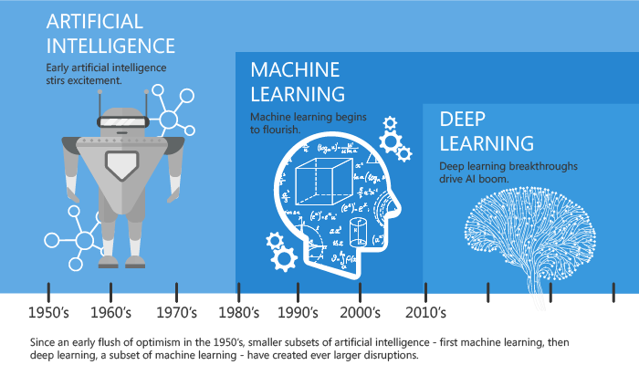
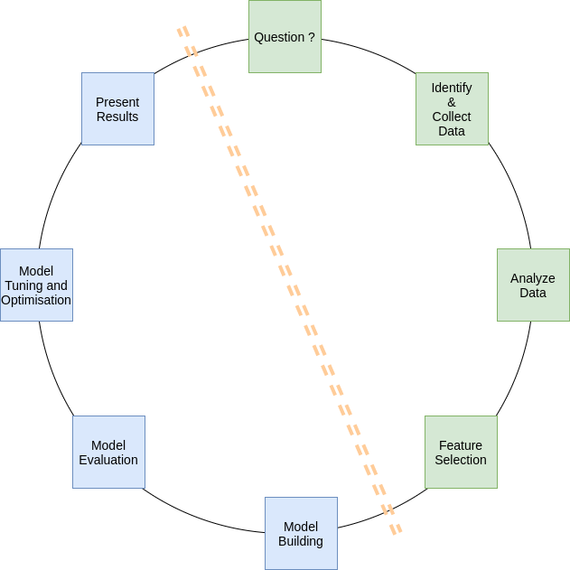

# Introduction to Machine Learning

## 1. Examples of ML use cases

* ## Prediction
* ## Recommendation
* ## Speech Recognition
* ## Medical diagnoses
* ## Financial industry and trading

##  2. A Quick History of Machine Learning

## ‘Godfathers of AI’ honored with [Turing Award](https://en.wikipedia.org/wiki/Turing_Award), the Nobel Prize of computing in 2018
#### Geoffrey Hinton, Yoshua Bengio and Yann LeCun

## 3. What is Machine Learning ?

### According to <a href="https://en.wikipedia.org/wiki/Arthur_Samuel">Arthur Samuel</a>, Machine Learning algorithms enable the computers to learn from data, and even improve themselves, without being explicitly programmed.

## 4. Types of Machine Learning

1. ### Supervised Learning
2. ### Unsupervised Learning 
3. ### <a href="./image/reinforcement_learning.png">Reinforcement Learning</a>

## 4. Data Science Project - Life Cycle
